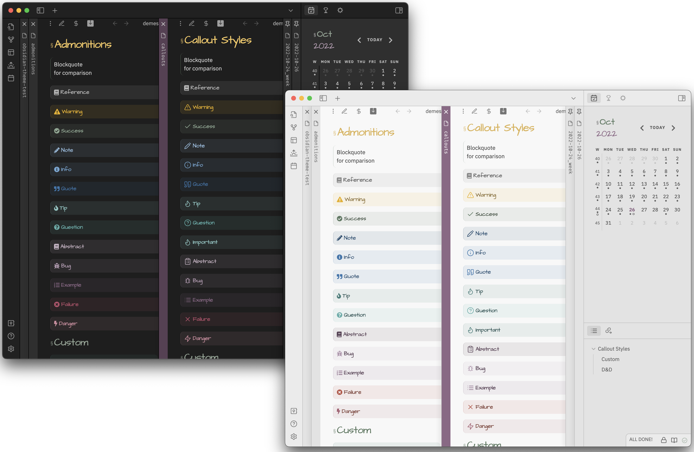
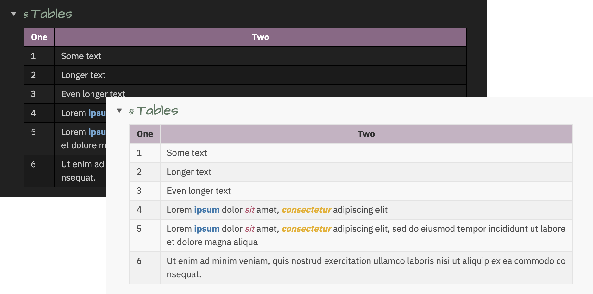
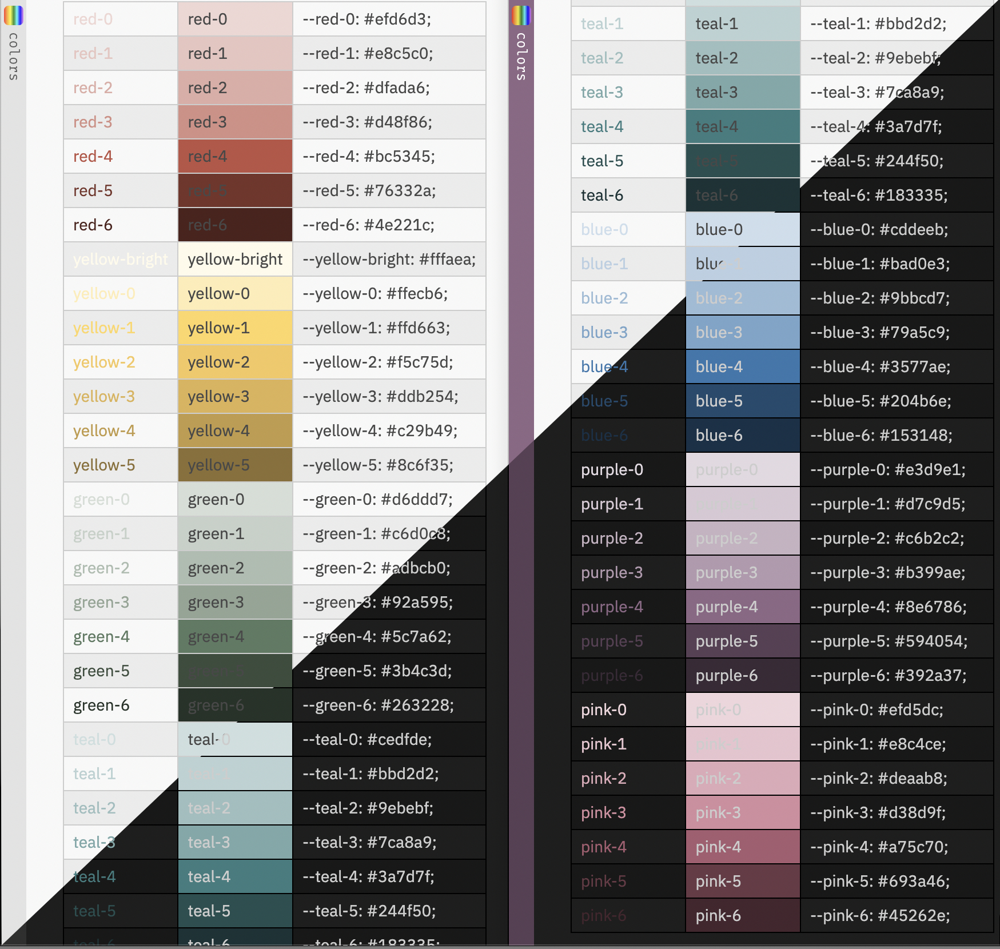
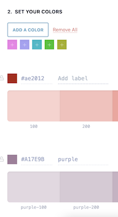

# Welcome to Ebullientworks Obsidian Theme 👋

<table><tr><td>Jump: </td>
<td><a href="#style-settings">Settings</a></td>
<td><a href="#admonitions">Admonitions</a></td>
<td><a href="#tables">Tables</a></td>
<td><a href="#colors">Colors</a></td>
<td><a href="#creating-your-own-accent-colors">Custom accents</a></td></tr></table>


This is a dark and light theme for [Obsidian.md](https://obsidian.md), a note taking app. 

Headers are styled and sized (for mobile and not) with and without Sliding panes (and rotated headers). Modals, tables, and other panels are also styled. 

Some light styling has also been applied for the following community plugins: 

- admonition
- calendar
- day planner
- sliding panes
- timelines
- tracker

## Style Settings

This theme does support style settings. Settable attributes: 

- "Show external links in edit mode"
    If true, external links (or the content of markdown links) will be shown in edit mode. External links are hidden by default.

- (0.1.8) "Float front-matter in a box to the right"
    If true, front-matter in preview mode will be collapsed in a top-right container.

- (0.2.0) "Prevent table content from extending beyond the width of the page" 
    If true, tables will have a maximum width set. Cell content will be wrapped (mid-word if necessary).

- Set custom fonts for 
    - Headings
    - Tags
    - Text (default font for text)
    - Monospace text

- Choose primary / secondary accent color
    This allows you to select the primary or secondary color from the colors in the palette (purple, pink, green, teal, or blue). You can also select a "custom" accent color, in which case, you should define and enable your own snippet as described below.

## Admonitions

As of version 6.5.1, you can disable the color picker for admonitions (globally or per-admonition) to have colors picked up from CSS styles instead. All of the default admonitions, in addition to two additional custom types, have been styled.

Those two custom types are:

- `reference`  
    Styled for inline reference metadata. Compact, monospace font.  
    To use this style, create a `reference` admonition (I recommend you use the closed book icon, but take your pick).
    
- `toc`
    Styled to create a floating (hover:right) section for Table of Contents
    To use this style, create a `toc` admonition (I recommend you use the list icon, but take your pick).
    
Here is what they look like (unstyled edit mode on the left): 



## Tables




## Colors

All colors are sourced from [this palette](http://htmlpreview.github.io/?https://github.com/ebullient/obsidian-theme-ebullientworks/blob/main/colors.html)



### Creating your own accent colors

The colors used by this palette are selected by applying a grayscale filter to a selected hue. 

1. Use the following URL to apply the same grayscale filter to a color of your choice: 
https://grayscale.design/app?lums=71.05,60.94,48.16,35.39,17.24,6.39,2.80&palettes=%23A17E9B&filters=0%7C0&names=purple&labels=

2. Create a snippet that contains your customized colors. 

#### Example

For example, let's use a REALLY BOLD RED: `#ae2012`.

1. If we visit the link above, we can scroll down a bit until we see a button "Add a color", and we paste this value (including the `#` in that field). This will show us something like this:



2. Scroll down until you see `Step 3`, which is the step you need to export your colors. You'll want to use the CSS variables.

    If we want to use this red as the primary color: 
    ```
    .primary-accent-custom {
        --primary-accent-0: rgb(250, 210, 206); /* red-100 */
        --primary-accent-1: rgb(248, 192, 187);
        --primary-accent-1-rgb: 248, 192, 187;  /* Note removal of rgb() function */
        --primary-accent-2: rgb(245, 163, 156);
        --primary-accent-3: rgb(241, 127, 117);
        --primary-accent-4: rgb(222, 40, 23);
        --primary-accent-4-rgb: 222, 40, 23;    /* Note removal of rgb() function */
        --primary-accent-5: rgb(142, 25, 15);
        --primary-accent-6: rgb(95, 17, 10);    /* red-700 */
    }
    ```

    If we want to use this red as the secondary color:
    ```
    .secondary-accent-custom {
        --secondary-accent-0: rgb(250, 210, 206); /* red-100 */
        --secondary-accent-1: rgb(248, 192, 187);
        --secondary-accent-1-rgb: 248, 192, 187;  /* Note removal of rgb() function */
        --secondary-accent-2: rgb(245, 163, 156);
        --secondary-accent-3: rgb(241, 127, 117);
        --secondary-accent-4: rgb(222, 40, 23);
        --secondary-accent-4-rgb: 222, 40, 23;    /* Note removal of rgb() function */
        --secondary-accent-5: rgb(142, 25, 15);
        --secondary-accent-6: rgb(95, 17, 10);    /* red-700 */
    }
    ```

3. Create a snippet (e.g. a file named`accent-colors.css`) containing this content in the `.obsidian/snippets` directory. Go to the Obsidian Appearance settings use the refresh button if necessary to find the snippet, and enable it. Provided you've selected the "custom" value in the primary/secondary style settings drop-down, you should be off to the races with this brilliant red.

## Credits

I've begged/borrowed/stolen CSS snippets from just about everywhere, but I started from vanilla and tried to be judicious about what to include to keep things lean. 

I frequently reference the following two themes, as they're often the quickest to consume a new CSS trick or snippet: 

- [Spectrum](https://github.com/Braweria/Spectrum)
- [ITS Theme](https://github.com/SlRvb/Obsidian--ITS-Theme)

If you have ideas or requests, please open an issue. ;)

<a href="https://www.buymeacoffee.com/ebullient" target="_blank"></a>
